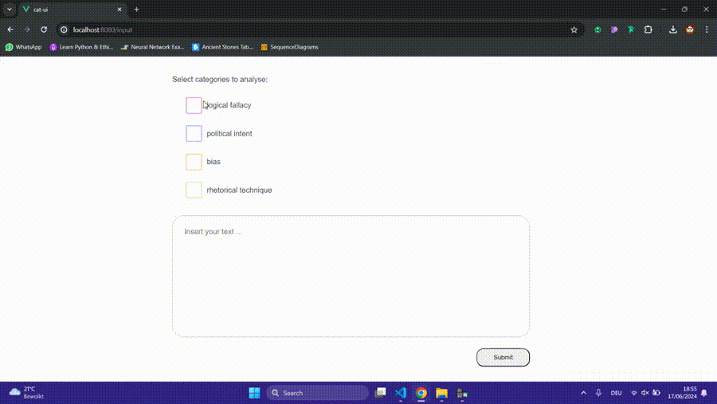
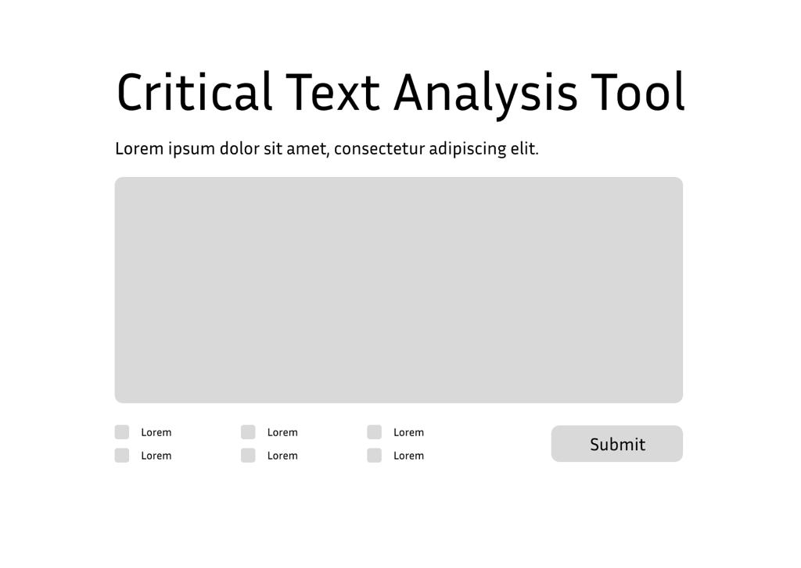
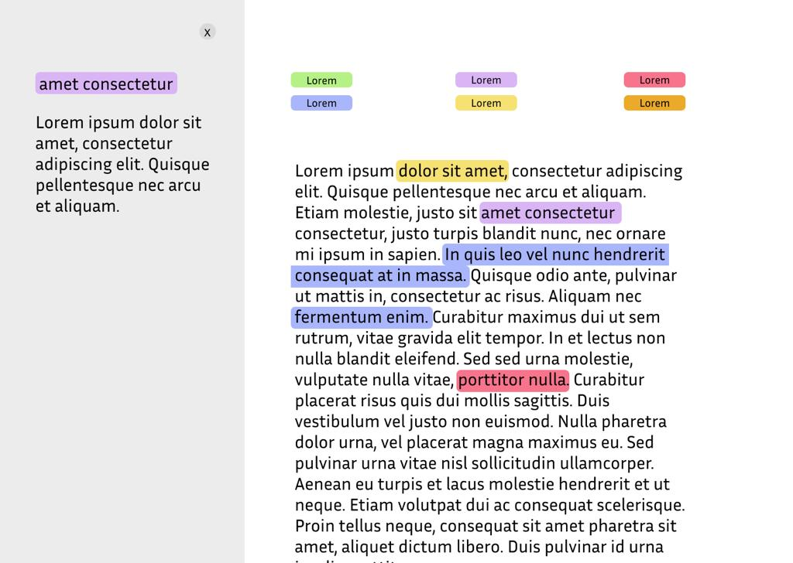

<h1>Demo</h1> `(--> Repository overview below)`

# Critical Analysis Tool - CAT
Critical Analysis Tool using a large language model (LLM) and Streamlit to build an application for support in analysing texts or news articles.

## Overview
### Repository Structure
- [**/docs**](docs) contains all documentation that has been created for the project
- [**/experiments**](experiments) contains notebooks and trial codes preparing for the actual implementation
- [**/src**](src) contains the source code for the application.

The application itself is broken down into a front end (cat-ui) and a back end (cat-api).
- cat-ui is a Single Page Web Application written in Vue.js with two routes: */input* and */result*
- cat-api is a python application using [FastAPI](https://fastapi.tiangolo.com/) and [LangChain](https://www.langchain.com/)

### Next steps (ideas)
- Improve looks of the GUI
- Improve UX
- Use streams to highlight text in real-time
- Use custom categories defined by the user
- Analysis of argument structure

## General
Some general support for getting into the topic of critical analysis and understanding the project.

### Elaboration on the word critical in the current context
“Critical” here as described in the third definition in the Britannica Dictionary:
> "
> Using or involving careful judgment about the good and bad parts of something
> - The program presents a *critical* analysis of the government's strategies
> - She has a talent for *critical* thinking
> - We need to look at these proposed changes **with a critical eye** before we accept them
> "

### Critical Text Analysis
Critical text analysis is part of evaluating and interpreting texts with the requirement of a comprehensive and objective approach. 
Important steps of critical text analysis include 
- critical reading to identify the author's thesis and main arguments
- summarizing the text to capture its core ideas
- considering the author's background and evidence

It is crucial to question the author's viewpoint, assess their arguments' quality, and evaluate their claims' strengths and weaknesses. A more thorough understanding of the text can be achieved through this methodology, leading to biases being more easily spotted and the validity of arguments being more easily assessed. Critical text analysis is a valuable skill that allows readers to engage with texts more meaningfully and thoughtfully.

## Initial Design and Approach

### UI
**Inputs** to the system should be made through a simple, user-friendly form. The design should include intuitive input actions/controls.
- Submit an input text, which could be a textarea to copy/paste the text into, an upload for PDF/docx/txt files, or a link to a text on a website (-> start with copy/paste for simplicity)
- Select (multiple) categories to analyse the text for (logical fallacies, journalistic standards, possible critical questions to ask)
- Submit text -> text field transforms to / extracted text displayed as ‘solid text’ on background -> loading animation

**Outputs** of the system should be visualised through colour highlighting per selected category.
- Display a legend connecting each colour to a category
- In the solid text highlight the text pieces recognised as belonging to a category by the system in the respective colour
- When hovering over the highlighted section, make an explanation appear for why the section is recognised as belonging to the category and/or how it would be done correctly.

### Defining categories
The use of LLM allows for a broader analysis of texts than using a narrower model that is only trained on assessing one specific category.
A category can be defined as any structure that can be detected in texts. It has to be manually added to the code currently by adding a new checkbox in the UI, a new prompt for the specific category and connecting these. This could be created more dynamically by creating a general prompt and letting the user input their preferred category. The downside of this is that the prompt cannot be optimised for the current use case.

Other ideas for categories (use cases), that came up in an interview with coordinators of AI for journalism, Iman Mossavat and Berry Sanders:
- Use case: for finding out of character topics
- Use case: for analysing the build-up of an argument
- Use case: for analysing decision making
- Use case: search related papers
- Category: Hate Speech
- Category: Sarcasm
 

#### Logical Fallacies
Logical fallacies represent types of reasoning that are flawed or misleading, setting them apart from subjective claims or those refutable by factual evidence. A position is deemed a logical fallacy if it contains inherent logical errors or deceptive elements. Some of the most commonly known ones are the Ad Hominem, Straw Man, and Slippery Slope. Read an explanation about these arguments and more types of arguments in the [Research Document](docs/Research.pdf)

#### Journalism Ethics
To provide transparency, journalists must ensure the reliability of their sources and disclose source motivations and conditions for providing information, particularly in sensitive or conflict situations. 
These principles collectively form a code of conduct that guides journalists in serving the public interest and thereby upholding an essential basis for justice and democracy. Read more about journalism ethics and related organisation standards in the [Research Document](docs/Research.pdf)

More categories are possible, for the MVP we have added logical fallacies and political intent as categories.
